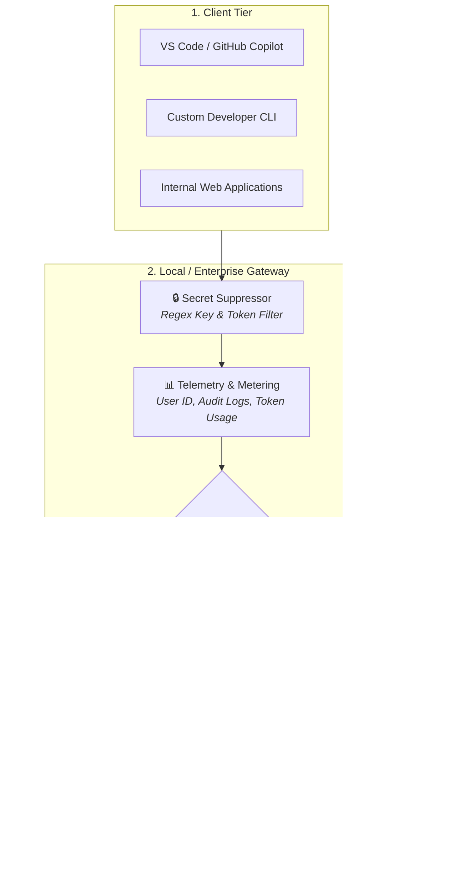
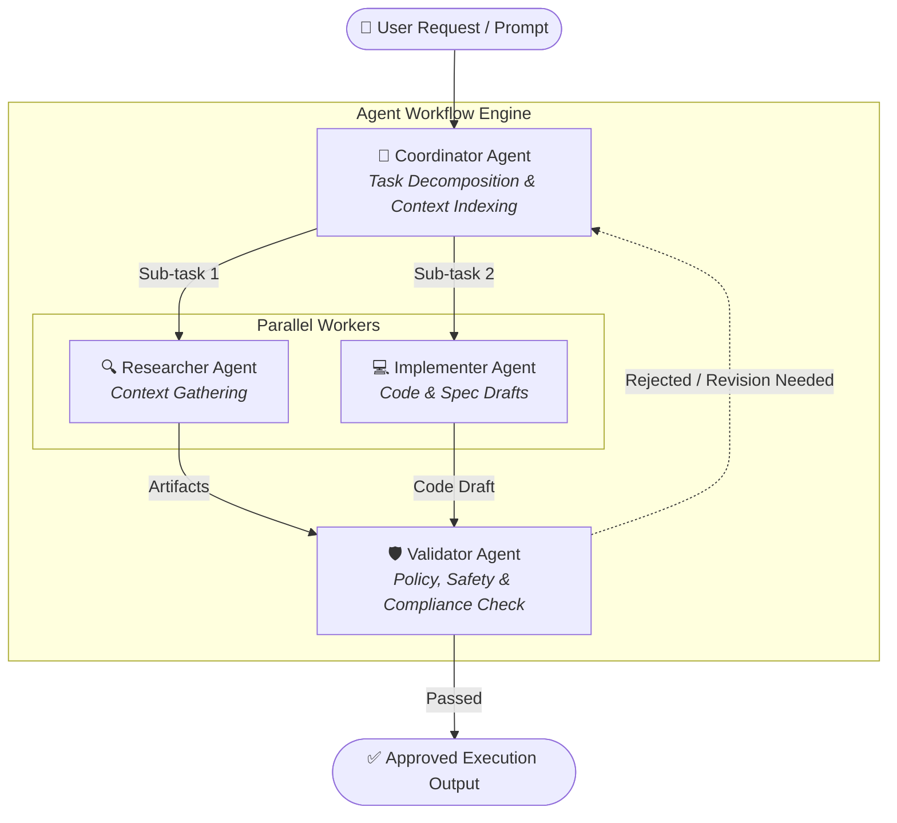
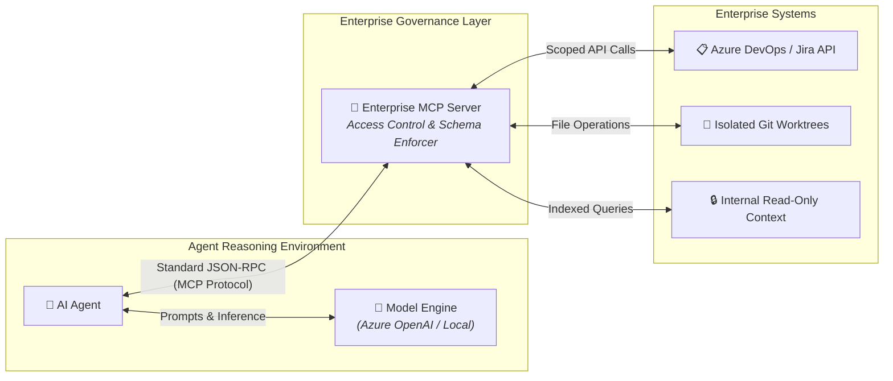
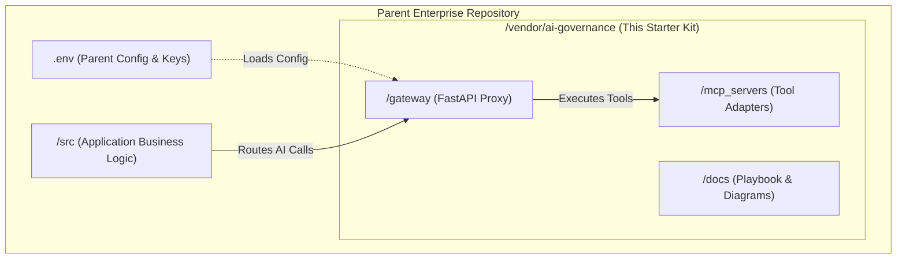

# Enterprise AI Reference Architectures

> **Author:** Andrew J. Siebert ([@Siebe41](https://github.com/Siebe41))

This document provides visual architectural models detailing how the Gateway, Local Models, Azure OpenAI, and Model Context Protocol (MCP) servers interact in enterprise environments.

---

## 1. Unified Gateway & Dynamic Model Routing Pattern

This pattern decouples client interfaces (IDEs, CLI tools, custom web apps) from underlying model providers. The Gateway enforces token metering, secret suppression, and cost-optimized routing before any prompt hits an LLM.



---

## 2. Multi-Agent Coordinator-Worker Execution Pattern

To handle non-trivial tasks, execution is divided using a **Coordinator-Worker** pattern. Complex prompts are decomposed by a Coordinator, processed in parallel by domain-specific Workers, and verified by a Validator before committing changes.



---

## 3. Secure Tooling Integration via Model Context Protocol (MCP)

Model Context Protocol (MCP) isolates model reasoning engines from direct database or API access. Agents request structured tool calls, and the MCP server enforces identity boundaries, permission scopes, and rate limits.



---

## 4. Sub-Repository / Submodule Integration Flow

How the starter kit embeds inside existing enterprise source trees without coupling parent project code to specific model providers.



```

```
